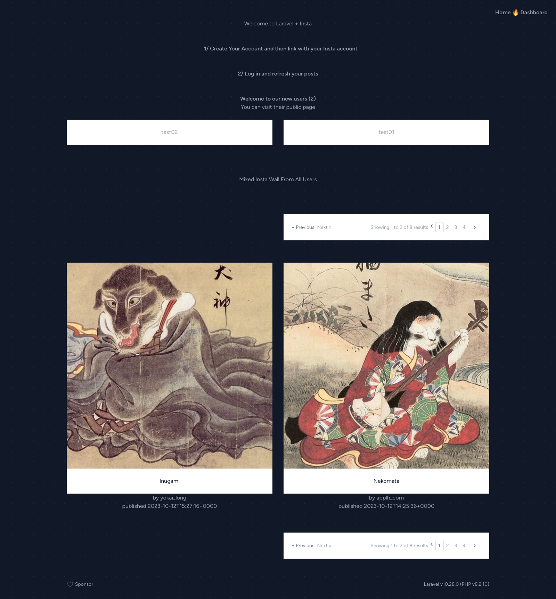
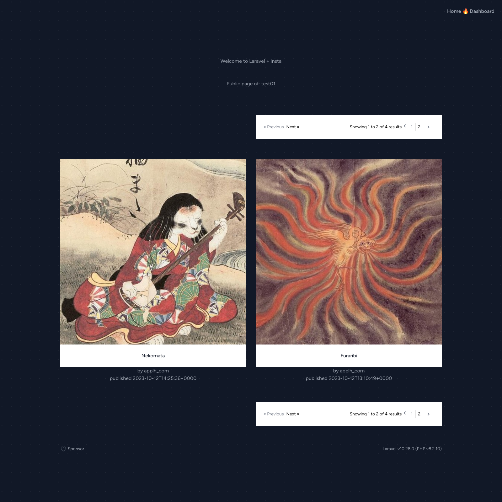
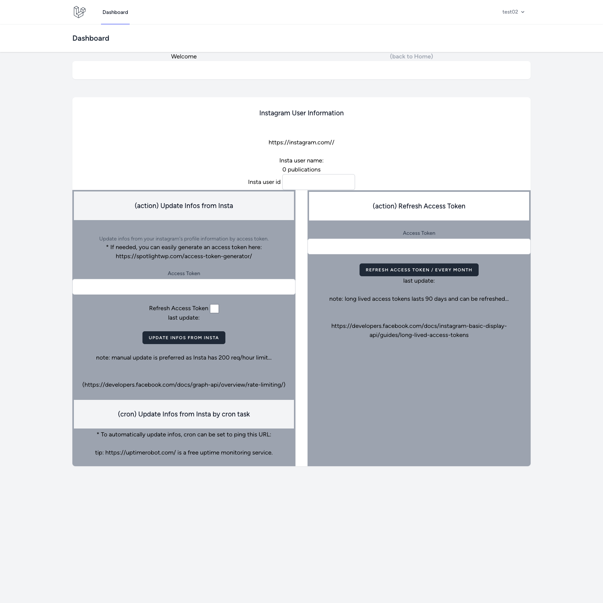
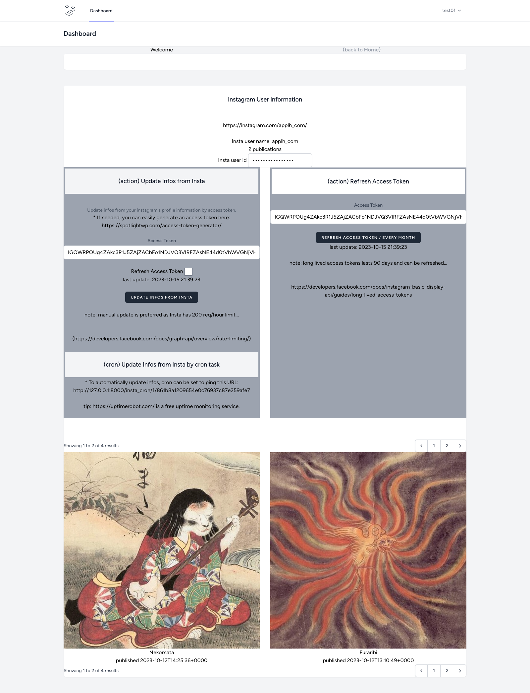
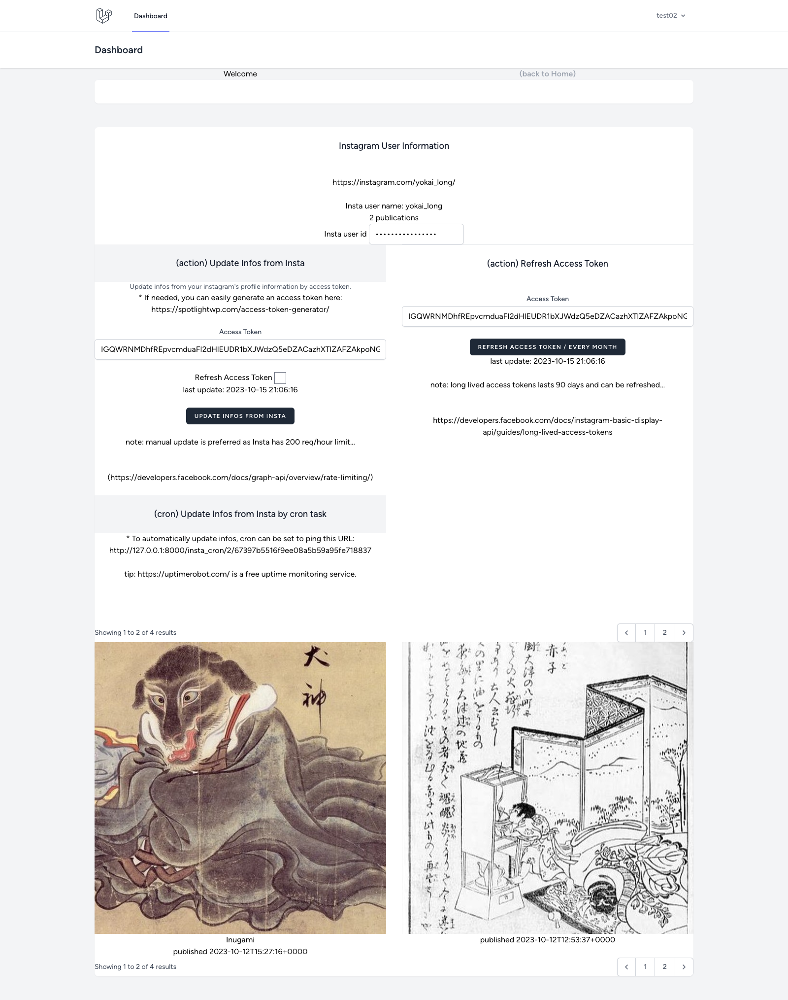

# Laravel Insta

## Objectifs

```

L'objectif : créer un système de récupération automatique des posts d'une page Instagram. 

Consignes : 
- Récupérer les derniers posts (donc quelques posts pas tous ceux de la page) et les afficher sur une page. 
- Cette récupération doit prendre en compte l'utilisation en production (ex : si un nouveau post apparaît sur la page Insta, qu'il soit pris en compte sur le système de récupération et non juste fait par rapport à une liste de posts figée à un instant T). 
- Nous nous concentrons ici essentiellement surtout sur l'aspect back-end.
- Il n'est évidemment pas nécessaire que ce soit une page Instagram personnelle.

```

## Instagram API

* L'API d'instagram permet de récupérer les posts d'un compte Instagram.
* L'API d'instagram est accessible via un token d'accès.
* Pour obtenir un token d'accès, il faut passer par une application Instagram.
  * Créer sa propre application Instagram
  * Utiliser une application Instagram existante
* En 2023, il y a des tokens d'accès longue durée (90 jours)
  * et qui sont renouvelables avant expiration

Dans le cadre de ce projet, on considère que si l'utilisateur a un token d'accès longue durée
* notre application a l'accord de l'utilisateur pour accéder à son compte Instagram
* on peut accéder à l'API d'Instagram de l'utilisateur pour récupérer ses posts

### Obtenir facilement un token d'accès longue durée

* On considère qu'il est hors du contexte de ce projet de proposer une application Instagram.

Le plus rapide est de passer par une application Instagram existante.
* exemple:
* https://spotlightwp.com/access-token-generator/
* avantages:
  * facile à utiliser (`personal account` ou `business account`)
  * pas besoin de créer une application Instagram
  * pas besoin de créer un compte développeur Instagram
  * pas besoin de demander l'accès à l'API Instagram

## Install from Github repo code

Si vous voulez tester le projet, vous pouvez cloner le repo Github et installer le projet.

```bash
git clone https://github.com/applh/laravel-insta.git laravel-insta

cd laravel-insta

composer install

# create .env file for Laravel (and sqlite database)
cp .env.example .env

# DB_CONNECTION=sqlite
# # DB_HOST=127.0.0.1
# # DB_PORT=3306
# # DB_DATABASE=laravel
# # DB_USERNAME=root
# # DB_PASSWORD=

# create SQLite database
php artisan migrate
# will create the database/database.sqlite file

# npm install
npm install
# build assets
npm run build

# launch server
php artisan serve

```

## Projet développement

Voici les grandes étapes pour coder le projet.

## Laravel Breeze

Pour ce projet, on s'appuie sur Laravel Breeze comme starter kit.
* Laravel Breaze est un starter kit pour Laravel.
* Laravel Breeze inclut les fonctionnalités suivantes :
  * authentification
  * email verification
  * password reset
  * session management
  * API support via Laravel Sanctum
  * Tailwind CSS
  * Vue.js
* Ainsi, toute la partie Gestion des utilisateurs est déjà implémentée.
  * register: création de compte utilisateur
  * login+logout: connexion utilisateur
  * dashboard: espaces utilisateur
  * ...


```bash

# install laravel
laravel new laravel-insta

cd laravel-insta

# create SQLite database
touch database/database.sqlite
php artisan migrate

php artisan serve

```

### Breeze install options

```

 ┌ Would you like to install a starter kit? ────────────────────┐
 │ Laravel Breeze                                               │
 └──────────────────────────────────────────────────────────────┘

 ┌ Which Breeze stack would you like to install? ───────────────┐
 │ Blade                                                        │
 └──────────────────────────────────────────────────────────────┘

 ┌ Would you like dark mode support? ───────────────────────────┐
 │ No                                                           │
 └──────────────────────────────────────────────────────────────┘

 ┌ Which testing framework do you prefer? ──────────────────────┐
 │ PHPUnit                                                      │
 └──────────────────────────────────────────────────────────────┘

 ┌ Would you like to initialize a Git repository? ──────────────┐
 │ Yes                                                          │
 └──────────────────────────────────────────────────────────────┘
 
 ...

 ┌ Which database will your application use? ───────────────────┐
 │ SQLite                                                       │
 └──────────────────────────────────────────────────────────────┘

 ...

```

## Objectifs: Affichage des posts Insta

* Sur la page `dashboard`, on va afficher les derniers posts Insta de l'utilisateur.
  * Il y a une pagination pour gérer un affichage d'un nombre maximal de posts.
* Sur la page d'accueil, on va afficher les derniers posts Insta de tous les utilisateurs.
  * Il y a une pagination pour gérer un affichage d'un nombre maximal de posts.
* Sur la page d'accueil, on va afficher les liens vers les pages des derniers utilisateurs.
* Sur la page d'un utilisateur, on va afficher les derniers posts Insta de cet utilisateur.
  * Il y a une pagination pour gérer un affichage d'un nombre maximal de posts.

## Controller: InstaController

```bash
php artisan make:controller InstaController
```

### Views: add routes and views

* route: insta_home
  * url: /
  * controller: InstaController::home()
  * view: insta_home.blade.php

* route: insta_user
  * url: /user/{name}
  * controller: InstaController::user()
  * view: insta_user.blade.php

* route: dashboard
  * url: /dashboard
  * controller: InstaController::dashboard()
  * view: dashboard.blade.php

* route: insta_api
  * url: /insta_api
  * controller: InstaController::api()
  * redirect to: dashboard

* route: insta_cron
  * url: /insta_cron
  * controller: InstaController::cron()
  * return json response

Add routes in  
* routes/web.php

Add views in
* resources/views/insta_home.blade.php
* resources/views/insta_user.blade.php
* (breeze) resources/views/dashboard.blade.php

## Dashboard

* Add form to enter Insta access token
* Add route `insta_api` to process form

* route: insta_api
  * url: /insta_api
  * controller: InstaController::api()
  * redirect to: dashboard


## Models: Laravel Eloquent

* API Instagram utiles
  * Avec le token d'accès on peut accéder au endpoint `me` pour récupérer les informations de l'utilisateur et aussi la liste de ses media
  * Avec le token d'accès on peut accéder au endpoint `media` pour récupérer les informations de chaque media

* Endpoint `me`
  * https://developers.facebook.com/docs/instagram-basic-display-api/reference/me/
  * https://developers.facebook.com/docs/instagram-basic-display-api/reference/user

* Endpoint `media`
  * https://developers.facebook.com/docs/instagram-basic-display-api/reference/media


Comme l'API Instagram a des limites de requêtes, on va stocker les données récupérées dans une base de données. (ici SQLite)
* Cela permet de ne pas faire de requêtes inutiles à l'API Instagram.

On va créer 2 modèles Eloquent:

* InstaUser
  * id (primary key)
  * user_id (breeze)
  * insta_access_token
  * insta_user_id
  * insta_username
  * created_at
  * updated_at
  * ...
  
* InstaMedia
  * id (primary key)
  * insta_media_id
  * insta_user_name
  * insta_media_type
  * insta_media_url
  * insta_media_caption
  * insta_media_timestamp
  * created_at
  * updated_at
  * ...


```bash
php artisan make:model InstaUser -m
php artisan make:model InstaMedia -m

# add project columns to migrations
# add columns to fillable in models

# create tables
php artisan migrate


```

## API Http Client

* On utilisera GuzzleHttp pour effectuer les requêtes HTTP vers l'API Instagram.

```
# add GuzzleHttp
composer require guzzlehttp/guzzle
```

## UX: Update manuel ou Automatique

* On peut imaginer 2 modes de fonctionnement:
  * Manuel: l'utilisateur doit cliquer sur un bouton pour récupérer les posts
  * Automatique: les posts sont récupérés automatiquement toutes les X minutes

* On va implémenter les 2 modes de fonctionnement.

* Si l'utilisateur en publie que rarement, on peut imaginer que le mode automatique ne soit pas très utile.

* Si l'utilisateur publie souvent, il est plus agréable que les posts soient mis à jour automatiquement.

* Comme l'API Instagram a des limites de requêtes, on va limiter le nombre de requêtes automatiques.
* On va proposer une URL privée pour chaque utilisateur qui voidrait mettre à jour ses posts automatiquement.

Il existe de nombreuses solutions pour mettre en place un système de tâches planifiées.
* Par exemple: https://uptimerobot.com/

## Renouveler le token d'accès

* Le token d'accès a une durée de vie de 90 jours.
* Il faut le renouveler avant expiration.

* On peut considérer que c'est une action manuelle de l'utilisateur à partir du `dashboard`.
  * (motivation à se connecter au `dashboard`régulièrement)


## Captures d'écran











## TODOS...

* supprimer le token d'accès
* supprimer les posts insta
* choisir de ne pas afficher certains posts insta
* choisir l'ordre d'affichage des posts insta
* ...


